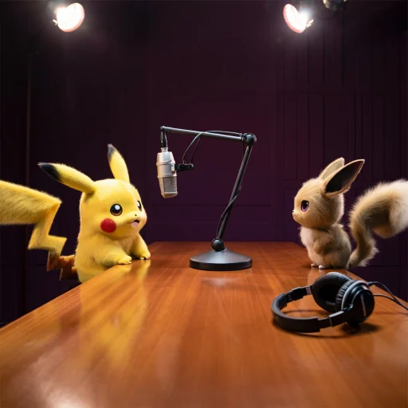

<div align="center">
    
</div>

# Promptdex - O guia definitivo para mestres da IA
### Roteiro do Episódio
Fala, pessoal! Sabe quando você escreve algo e, como num passe de mágica, a IA te responde com um poema, uma imagem ou até um plano de negócios? Então, isso não é magia — é prompt! Bem-vindos ao Promptdex – O guia definitivo para mestres da IA, o lugar onde até iniciantes aprendem a domar IAs como verdadeiros mestres Pokémon! Eu sou o Ash — não o treinador, mas quase — e hoje o papo é rápido, direto e vai mudar como você conversa com inteligências artificiais!

Pra começar, uma curiosidade que pouca gente sabe: as IAs não "pensam" como a gente. Elas não têm consciência nem sabem o que estão dizendo. Elas são como loros muito avançados que aprenderam a repetir padrões com base em trilhões de palavras que já viram. Quando você digita um prompt, ela só tenta adivinhar qual é a resposta mais provável, como um jogo de adivinhação em altíssima velocidade. Então, quanto mais claro e direto você for, melhor ela responde. É tipo dar a ordem certa pra um Pokémon durante a batalha — se você disser “faz aí”, ela pode usar “Splash”. Mas se disser “usa Choque do Trovão contra o Pidgey”, aí sim, meu amigo, é super eficaz!

Agora, bora pra uma ferramenta que pode te ajudar a mandar bem nos prompts mesmo se você ainda estiver no nível 1 da jornada: o site FlowGPT. Ele é tipo um mercado de prompts — tem prompt pra tudo! Desde pedir um resumo de um livro, até gerar ideias de presente pro seu cachorro. E o melhor: você pode ver o que outras pessoas já usaram, copiar, testar e adaptar. É como se a comunidade inteira de desenvolvedores estivesse compartilhando ataques especiais pra você colocar no seu arsenal. Muito mais fácil do que sair testando no escuro, né?

E aí, curtiu essas dicas? Então faz o seguinte: compartilha esse episódio com aquele amigo que ainda acha que prompt é só o C:> piscando na tela! E se quiser continuar essa jornada pela Ordem dos Desenvolvedores, fica ligado nos próximos episódios, porque ainda tem muita dica maneira vindo aí.

Por hoje é só, jovem mestre da IA. Até a próxima… Ash aqui!


### 🧠 Prompt para Imagem (RAVE)
```markdown
"A yellow Pikachu sits at a wooden podcast table with a professional microphone, engaged in an interview with evee. The podcast setup includes silver microphones on articulating boom arms, black headphones, and LED recording lights. Pikachu and evee face each other across the table in a modern recording studio setting with soundproofing panels visible on dark purple walls. Warm studio lighting illuminates the scene from overhead, casting soft shadows on the polished wooden table surface. Studio photography with dramatic lighting and cinematic color grading in a square 1:1 aspect ratio."

```

### 🧠 Prompt para o Nome (chatGPT)
```markdown
"Você é um roteirista de podcast, e vamos criar um podcast de tecnologia, focado em engenharia de prompt e eu gostaria de uma ajuda sua para criar 5 sugestões 
de nomes criativos para um podcast de engenharia de prompt feito por nerds, e que tenha algum trocadilho nerd no nome 

O podcast vai falar sobre dicas e novidades sobre o mundo de IAs, engenharia de prompt e o que está acontecendo no mercado 

{REGRAS}

- O nome deve ser enxuto, um nome e um subtítulo
- O nome tenha algum trocadilho nerd com Pokemon 
- O nome deve conter alguma palavra forte que remeta IAs 

{REGRAS NEGATIVAS}
  - Não utilize a palavra Engenharia no nome nem qualquer variação dela"

```

### 🧠 Prompt para roteiro (chatGPT)
```markdown
"Você é um roteirista de podcast, e vamos criar um  roteiro de um podcast de tecnologia, focado em engenharia de prompt cujo o nome é "Promptdex - A Ordem dos Desenvolvedores" e tem foco em engenharia de prompt,  com o público alvo de iniciantes em engenharia de prompt 

o formato do roteiro deve ser
[INTRODUÇÃO]
[CURIOSIDADE 1]
[CURIOSIDADE 2]
[FINALIZAÇÃO]

{REGRAS}

- no bloco [INTRODUÇÃO] substitua por uma introdução iguais as introduções dos vídeos do canal coisas de nerd 
- no bloco [CURIOSIDADE 1] substitua por uma curiosidade de IAs 
- no bloco [CURIOSIDADE 2] sobre uma ferramenta para engenharia de prompt
- no bloco [FINALIZAÇÃO] substitua por uma despedida cool com o final 'Ash aqui' 
- use termos de fácil explicação
- O podcast vai ser apresentado somente por uma pessoa, chamada Ash 
- O podcast deve ser curto

{REGRAS NEGATIVAS}

- Não use muitos termos técnicos
- Não ultrapasse 3 minutos de duração"

```
